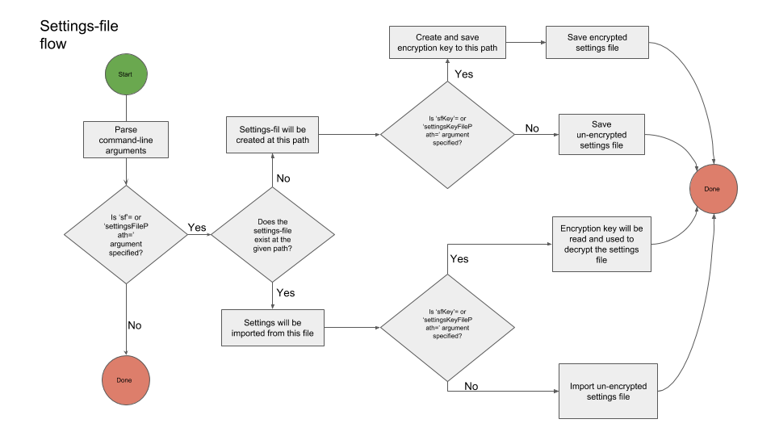
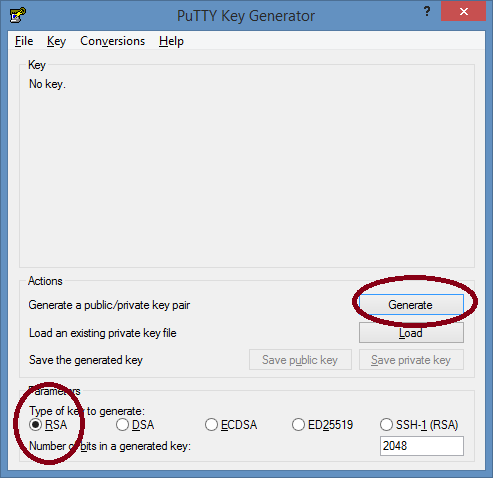
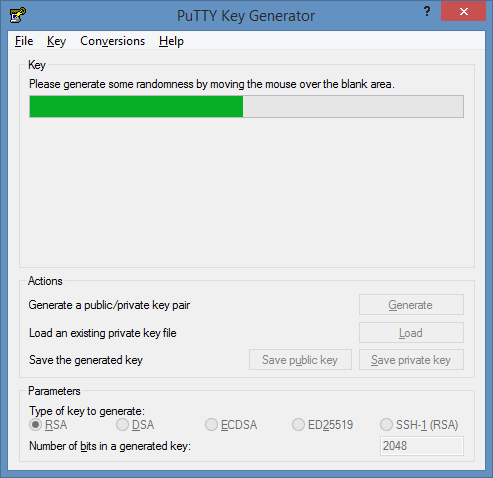
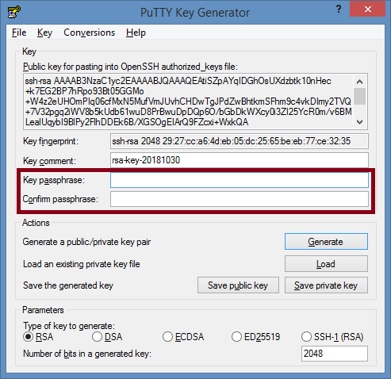
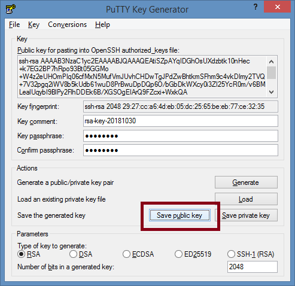
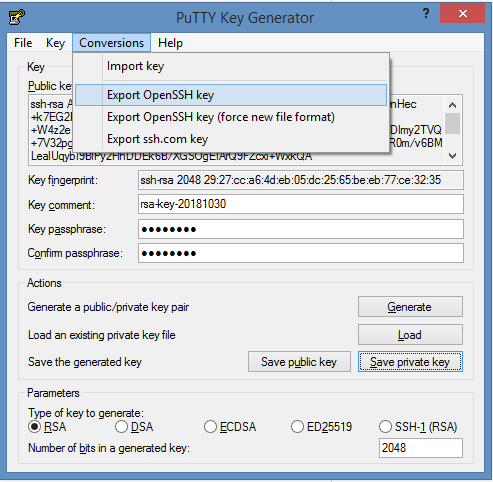

# dotnet-sftpclient

### A C# .NET implementation of a commandline-based SFTP client. [Based on SSH.NET](https://github.com/sshnet/SSH.NET).

* __No installation required__ - only permissions to run the .exe is needed. Runs from single commandline. Thus easy to use with windows task scheduler or other scheduling tools.

* All arguments can be __saved to a settings-file__ and easily __invoked later__. This can help reduce complexity, and furthermore facilitate automatic generation of transfer-settings.

* __Supports encryption__ of the settings files, so that no-one may access the settings - including user-names, passwords and private key paths - in a manual fashion. The encryption/decryption key is typically saved to a network-drive which other users cannot access.

* Other Features
  * Upload single files or entire directories.
  * Directories may be __compressed__ in zip-format before upload.
  * Configurable number of retries.
  * Supports upload of calculated __checksum-file__ (sha256) for each uploaded file, or for an entire directory.
  * Supports pre-fixing (of your own choice) of files while in upload, so it's possible to keep away from them until they're fully uploaded.
  * Default logs to a text-file 
  * Supports drop-in of custom logger-implementation.
  * Need other features? Scroll the the bottom...


### Requirements

Requires .NET framework 4.7 runtime or higher installed on the machine. Requires Windows OS. 

### Download

Download the tool [here](./dotnetsftp.exe), I compiled it into a single console exe-file.

(If you wish to compile the console app into a single console exe-file yourself, you can use the ILMerge tool from Microsoft for this purpose. The command-syntax i used is this, 'c:\tmp\ILMerge.exe /target:exe /targetplatform:v4,"C:\Windows\Microsoft.NET\Framework\v4.0.30319" /out:sftpclient.exe /wildcards /allowDup *.exe *.dll')

### How to use

- Run it from a command-line - PowerShell, preferably. 

- Start with a simple example, before moving to the Task Scheduler. It's much easier to get cracking when you've got a working example, loads of stuff can go wrong with sftp-servers - lack of connectivity, invalid certificates, revoked private keys, so on and so forth.

- Then, when you got a good transfer going, move it to a task scheduling component, such as Windows Task Scheduler.

Example - Upload single file to an sftp-server. Defaults to port 22, defaults to 3 retries, defaults to logging to a log.txt file:
	
```powershell
./dotnetsftp --transferType=upload  --host=address-of-the-sftp-server --username=testName --password=testPw --sp=c:\fileToUpload.txt --dp=/home/user/pathToUploadTo
```

Example - Upload entire directory to an sftp-server:

```powershell
./dotnetsftp --transferType=upload --host=address-of-the-sftp-server --username=testName --password=testPw --sp=c:\directoryOfFilesToUpload --dp=/home/user/pathToUploadTo
```

Example - upload single file, using username/password as well as private key-file issued from the server's public key-file. Compress the file and create a checksum-file to go along with it:

```powershell
./dotnetsftp --transferType=upload --host=address-of-the-sftp-server --username=testName --password=testPw --pk=c:\myKeyFiles\privateKeyOpenSSH.key --sp=c:\directoryOfFilesToUpload --dp=/home/user/pathToUploadTo --checkSum --compressDictionary
```

Example using network-style paths: Upload single text test file, save settings file, encrypt it, save encryption file:

```powershell
./dotnetsftp --transferType=upload --address-of-the-sftp-server --username=testName --password=testPW --pk=\\networkshare\subfolder\privateKeyOpenSSH.key --dp=/temp --sp=\\networkshare\subfolder\test.txt --ow --settingsFilePath=\\differentNetworkshare\upload.settings --settingsKeyFilePath=\\evenDifferentNetworkshare\\uploadTest.settingsKey
```

The above example saves a settings-file, which serializes all the settings and encrypts them using a generated key. Note how you can, and should, move the private-key, the settings-file AND the settings-key file to wholly different network-paths, with likely distinct file share access rights.

Having saved the settings into a file, you can then invoke it thus:
```powershell
./dotnetsftp --settingsFilePath=\\differentNetworkshare\upload.settings --settingsKeyFilePath=\\evenDifferentNetworkshare\\uploadTest.settingsKey
```

Throughout the examples, the longer argument-names are used. Most have abbreviated versions. Check out the help-text:
```powershell
./dotnetsftp --help
```

### Setting-file flow

The presence of a existing settings-file argument determines if a transfer will be initiated from an existing settings-file, or if the settings-file will be persisted. The check is simple: if the settings.file exists, it will be read - possible be decrypted, if the settings-key-file path argument is provided - and the transfer executed form the read settings. Otherwise it will be created - possible in encrypted form, if the settings-key-file path argument is provided.

The persistence of settings-files flow can be visualized thus:




### About public and private keys

What is this about 'keys'? Keys are an added security measure. A username and password is the first line of defence - without them, we can't gain access. But they may fall into wrong hands. As opposed to something we _know_,  even better is something we _have_ - i.e. a key-file, that only we have access to. This concept - something we _have_ - is known as _two-factor authentication_ and should be used whenever possible.

In the case of an SFTP-server, the server-administrator will typically generate a public-key, and use this public key to create a private key. The private key can be tested against the public key, and only the public key that created the private key will match. The public key is kept on the server, the private is given to the user, to the client-program that needs to connect. And so, when the connection is made, the private key will be sent to the server and tested for a match against the public key, that was used to create it - and only if the two match will the connection be allowed.

[Quite a decent article about the concept of public/private keys](http://www.jscape.com/blog/what-is-an-sftp-key).

Basically, always use keys as a second challenge, beyond what username and password can offer.


* How should I generate the keys?

 I use PuTTYGen to generate my keys:

 1. Generate the keys
	

 2. Wait for it...
 	

 3. Specity a passphrase - let's go with 'wallen11', for example.
  	
 
 4. Save the public key - this goes to the server.
	

 5. Save the private key - by which we can authenticate against the server. <br> 
    IMPORTANT! SSH2 keys have no standard format. Putty's format is different than OpenSSH's format. And this tool only supports OpenSSH keys. So we'll have PuTTYgen perform an OpenSSH export.
    
	

 6. Now - if the public key was correctly stored on the SFTP server - we should be able to log into the SFTP-server and authenticate by way of the keys we just generated. Note how 'password' is actually the 'passphrase', that we specified in step 3.

 ```
 dotnetsftp.exe --tt=upload --host=<your_sftp_server_host> --port=<port_no_usually_22> --username=tester --password=wallen11 --dp=/user/home --sp=c:\temp\test.txt --pk=<path_of_the_private_key_file_in_OpenSSH_format>
  ```
  

### Need a way to test this client? 

Included in the SolutionItems folder is a free sftp-server, [RebexTinySftpServer](https://labs.rebex.net/tiny-sftp-server), that can be used with integration testing (I used it for the integration-tests for this project). It's free for commercial and non-commercial use. And supports public/private keys authentication. Highly recommend it. 


### Needful things

I encourage issues and pull requests.

* TODO: Support download-functionality. Only upload-functionality is working, for now.
* TODO: Include sftp-server fingerprint confirmation. Like so: https://github.com/sshnet/SSH.NET#verify-host-identify
* TODO: Support up-/download by wild-card. As is, only allows single file or entire directory.


### Let me know

Let me know - by way of the issues - if you're stuck with anything. I'd like to try and help out, and make this tool better over time.

